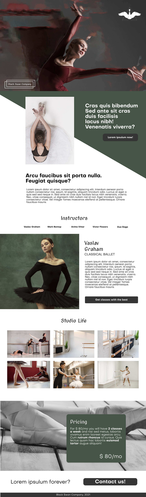

# Website: Black Swan Company

<b>Made with:</b><br/>
Lorem ipsulum v1.4
<br/><br/>
<b>What is this?</b><br/>
A website for a fictional ballet company
<br/><br/>
<b>Description:</b><br/>
It was prototiped using Figma, the images are from Freepik, edited using Photoshop
and, for the code, I used Bootstrap 4.6
<br/><br/>
# Quick links &#128150;
<div>
  
[PROJECT SETUP](#Project-setup) &diams; [PREVIEW](#Preview) &diams; [STATUS OF THE PROJECT](#How-is-the-development-of-the-project-right-now) &diams; [CREDITS](#Credits) &diams; [BACK TO TOP](#Website-Black-Swan-Company)

<div>

# Project setup
```
 Open the index.html at your favorite browser! ;D
```

<b>Thank you for your support!</b>

# Preview



# How is the development of the project right now?
<b>Last update:</b> 14/02/2021

Lorem ipsum dolor sit amet, consectetur adipiscing elit. Proin pharetra molestie finibus. Donec lacinia quam at est lobortis tempus. Proin ac ipsum vel orci aliquam consectetur.

<br/>

# Credits

The down below are the credits of all sources that I used to composed the images:

<b>HEADER</b>

The image of the header was the mix of the 2 down below images, with some Photoshop magic:

<b>Logo of the black swan:</b>
<a href="https://www.freepik.com/free-vector/swan-silhouette-concept_7327566.htm" target="_blank">Swan silhouette</a>
<br>
<b>Woman of the banner:</b>
<a href="https://www.freepik.com/free-photo/young-beautiful-modern-style-dancer-jumping_8679628.htm" target="_blank">Dancer jumping</a>

<b>ABOUT</b><br>
Image: <a href="https://www.freepik.com/free-photo/ballerina-dancer-sitting-down-with-her-legs-crossed_7932597.htm#position=29" target="_blank">Ballerina sitting down</a>

<b>Instructors</b>
Vaslav Graham: <a href="https://www.freepik.com/free-photo/young-graceful-tender-ballerina-dark-studio_8821590.htm" target="_blank">Ballerina dark studio</a>

<b>Studio</b>
Photo 01: <a href="https://www.freepik.com/free-photo/professional-ballerinas-training-together-with-pointe-shoes-leotards_12059939.htm" target="_blank">Ballerinas training</a><br>
Photo 02: <a href="https://www.freepik.com/free-photo/professional-ballet-studio-with-handrail_7076802.htm#page=1&query=studio%20ballet&position=9" target="_blank">Ballet studio with handrail</a><br>
Photo 03: <a href="https://www.freepik.com/free-photo/close-up-ballet-studio-handrail_7076831.htm" target="_blank">Close up ballet studio</a><br>
Photo 04: <a href="https://www.freepik.com/free-photo/front-view-ballerina-rehearsing-floor_12059892.htm" target="_blank">Front view ballerina rehearsing</a><br>
Photo 05: <a href="https://www.freepik.com/free-photo/cute-little-ballerinas-pink-ballet-costume-children-pointe-shoes-is-dancing-room-kid-dance-class-with-teacher_11799899.htm#page=1&query=studio%20ballet&position=22" target="_blank">Little ballerinas</a><br>
Photo 06: <a href="https://www.freepik.com/free-photo/cute-little-ballerina-pink-ballet-costume-child-pointe-shoes-is-dancing-room-kid-dance-class_11155275.htm" target="_blank">Little ballerina pointe shoes</a><br>

<b>PRICING</b>
<a href="https://www.freepik.com/free-photo/professional-ballerina-putting-her-ballet-shoes_8679374.htm" target="_blank">Professional ballerina putting her ballet shoes</a>

<div>
  
[PROJECT SETUP](#Project-setup) &diams; [PREVIEW](#Preview) &diams; [STATUS OF THE PROJECT](#How-is-the-development-of-the-project-right-now) &diams; [CREDITS](#Credits) &diams; [BACK TO TOP](#Website-Black-Swan-Company)

<div>


